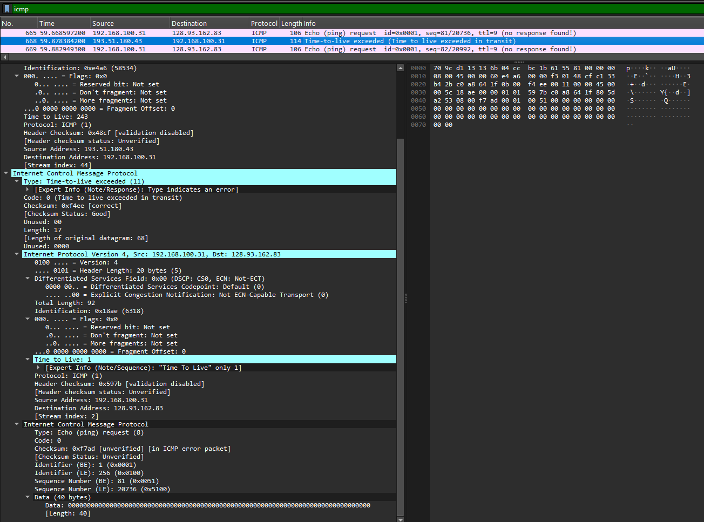

# **LAPORAN PRAKTIKUM JARINGAN KOMPUTER**
## **MODUL 12: ANALISIS PROTOKOL ICMP & PROGRESS TUGAS BESAR**

### **Informasi Mahasiswa**
* **Nama Lengkap:** Jevico Royvaldo
* **Nomor Induk Mahasiswa (NIM):** 103072400151
* **Kelas:** IF-04-01

---

## A. Sasaran Praktikum
1. Memahami secara mendalam mekanisme dan fungsi protokol ICMP (*Internet Control Message Protocol*) memanfaatkan *software* Wireshark.
2. Mengembangkan aplikasi pengetesan konektivitas mandiri (*ICMP Pinger*).
3. Melaporkan perkembangan serta asistensi pengerjaan proyek tugas besar jaringan komputer.

---

## B. Metodologi & Langkah Kerja

### 1. Eksperimen 1: Analisis ICMP Melalui Utilitas Ping
1. Jalankan aplikasi terminal **Command Prompt** (CMD) pada sistem operasi Windows.
2. Buka aplikasi **Wireshark**, lalu aktifkan mode pengambilan paket (*packet capture*) pada antarmuka jaringan (*interface*) yang sedang aktif terhubung ke internet.
3. Kirimkan pesan uji konektivitas ke server target luar benua dengan parameter pembatasan jumlah paket sebanyak 10 interaksi menggunakan perintah:
   `ping -n 10 www.ust.hk`
4. Tunggu hingga terminal menyelesaikan seluruh siklus transmisi (10 *Echo Request* dan 10 *Echo Reply*).
5. Hentikan perekaman paket pada Wireshark.
6. Gunakan filter tampilan (*display filter*) dengan mengetik kata kunci `icmp` untuk mengisolasi paket data yang relevan.
7. Lakukan pengamatan struktural terhadap komponen *header* paket, baik pada segmen *Echo Request* maupun *Echo Reply*.

### 2. Eksperimen 2: Analisis ICMP Melalui Utilitas Traceroute
1. Buka kembali jendela **Command Prompt** dan mulai ulang penangkapan paket baru di **Wireshark**.
2. Lakukan pelacakan rute interkoneksi menuju server di kawasan Eropa dengan mengeksekusi perintah:
   `tracert www.inria.fr`
3. Amati proses penelusuran jalur hingga sistem berhasil memetakan seluruh lompatan jaringan (*hop*) sampai ke destinasi akhir.
4. Matikan perekaman paket pada Wireshark, kemudian terapkan kembali filter pemisah `icmp`.
5. Analisis secara saksama kemunculan variasi pesan ICMP seperti *Time Exceeded* dan *Echo Reply* yang dihasilkan selama proses pelacakan.

---

## C. Hasil Observasi dan Pembahasan

### 1. Dokumentasi Log Terminal (CMD) - Pengujian Ping
Berikut adalah rekaman log dari terminal Command Prompt saat mengeksekusi pengujian konektivitas:

*Gambar 1: Hasil eksekusi utilitas Ping dan Traceroute di Command Prompt.*

Dari hasil log terminal di atas, metrik performa jaringan dapat dijabarkan dalam tabel berikut:

| Parameter Evaluasi | Nilai Riil | Interpretasi & Analisis Teknis |
| :--- | :---: | :--- |
| **Paket Terkirim (*Sent*)** | 10 Paket | Protokol TCP/IP lokal berhasil mengemas dan memancarkan seluruh permintaan uji tanpa kendala internal. |
| **Paket Diterima (*Received*)** | 10 Paket | Target host (*server* di Hong Kong) sukses menerima dan mengembalikan umpan balik secara lengkap. |
| **Persentase Kehilangan (*Loss*)** | **0%** | Jalur komunikasi internasional berada pada status stabil dan andal tanpa adanya fenomena *packet dropping*. |
| **Waktu Respons Rata-rata (*Avg RTT*)** | **62 - 64 ms** | Latensi transmisi sangat optimal untuk kategori koneksi antar-negara/lintas benua. |
| **Waktu Respons Minimum (*Min RTT*)** | **52 ms** | Batas bawah waktu tempuh siklus bolak-balik (*round-trip*) paket. |
| **Waktu Respons Maksimum (*Max RTT*)** | **69 ms** | Batas atas penundaan transmisi, tetap berada pada batas toleransi performa prima. |
| **Sisa Batas Lompatan (*TTL*)** | **43** | Dengan standar TTL bawaan Windows sebesar 128, paket diperkirakan telah melewati **85 node/router perantara** (dihitung dari rumus: $128 - 43$). |

### 2. Pembedahan Struktur Paket ICMP Ping via Wireshark
Berdasarkan visualisasi filter Wireshark, tercatat sebanyak 20 paket ICMP terisolasi secara sempurna, merepresentasikan interaksi 10 pasang *request-reply*.

*Gambar 2: Rekaman lalu lintas paket ICMP Ping pada panel Wireshark.*

#### A. Analisis Parameter Paket Echo Request (Klien $
ightarrow$ Server)
Saat komputer lokal (`192.168.100.31`) mengirimkan sinyal ke server target (`143.89.209.9`), *header* ICMP yang terbentuk memiliki karakteristik sebagai berikut:
* **Type:** `8` — Mengindikasikan secara absolut bahwa paket berfungsi sebagai *Echo (ping) request*.
* **Code:** `0` — Menunjukkan sub-kondisi standar atau variasi dasar dari *request*.
* **Checksum:** `0x4d50` — Validasi integritas lapisan jaringan berstatus baik/valid (*Good/Correct*).
* **Sequence Number:** `11 (0x000b)` — Identifikasi nomor urut transmisi paket ke-11.
* **Payload Data:** `32 bytes` — Berisi rentetan string karakter uji alfabetis standar (*dummy data*).

#### B. Analisis Parameter Paket Echo Reply (Server $
ightarrow$ Klien)
Pihak target merespons balik menuju host pengirim dengan modifikasi struktur *header* sebagai berikut:

*Gambar 3: Lapisan struktur detail paket ICMP Echo Reply.*

* **Type:** `0` — Menandakan status paket sebagai balasan resmi (*Echo (ping) reply*).
* **Code:** `0` — Format kode balasan standar tanpa indikasi *error*.
* **Checksum:** `0x5550` — Integritas data terverifikasi aman (*Good/Correct*).
* **Sequence Number:** `11 (0x000b)` — Sinkron dengan nomor urut yang dikirimkan pada *Echo Request* untuk pencocokan RTT.

**Tinjauan Alur Komunikasi:**
Proses pertukaran data berlangsung secara teratur dan sekuensial. Setiap kali host `192.168.100.31` melepas paket Tipe 8, simpul tujuan `143.89.209.9` langsung menyambutnya dengan mengirimkan balik paket Tipe 0. Seluruh runtunan dari *frame* 425 hingga 598 membuktikan konektivitas berjalan lancar tanpa interupsi.

### 3. Dokumentasi Log Terminal (CMD) - Pengujian Traceroute
Proses pemetaan jalur transmisi menuju host tujuan regional Eropa (`www.inria.fr` dengan IP `128.93.162.83`) memperlihatkan rincian lompatan sebagai berikut:

*Gambar 4: Deteksi jalur lompatan jaringan menggunakan perintah Tracert.*

Analisis teknis dari hasil pelacakan rute tersebut meliputi:
* **Total Lompatan (*Hops*):** Terdeteksi sebanyak **12 kali lompatan** perangkat untuk mencapai titik akhir tujuan di Prancis.
* **Frekuensi Probe:** Sistem mengirimkan 3 sampel paket pengujian pada tiap tahapan nilai TTL guna mendapatkan variansi data latensi yang akurat pada node yang sama.
* **Mekanisme Kerja Router:** Tiap router perantara terpaksa mengembalikan paket ke asal dalam bentuk pesan kesalahan *Time Exceeded* (Tipe 11, Kode 0) karena nilai TTL paket sengaja dikondisikan habis (bernilai 0) sesampainya di router tersebut.
* **Destinasi Akhir:** Begitu nilai TTL dinaikkan secara bertahap hingga menyentuh angka 12, paket berhasil menembus *server* utama `128.93.162.83` yang kemudian membalas dengan paket *Echo Reply*.

**Peta Aliran Topologi Jaringan:**
1.  **Sektor Lokal:** Paket bergerak keluar melewati gerbang utama (*Default Gateway*) lokal (`192.168.100.1`).
2.  **Sektor Domestik:** Memasuki infrastruktur jaringan inti milik ISP lokal Indonesia (terlihat pada blok IP kelas privat `10.x.x.x` dan IP publik `180.x.x.x`).
3.  **Sektor Internasional:** Paket dialihkan melewati jalur transit global RENATER di Prancis (terbaca melalui IP gateway `37.49.236.19` dan `193.51.180.43`).
4.  **Sektor Destinasi:** Paket memasuki lingkup jaringan internal privat INRIA dan berakhir di server `128.93.162.83`.

### 4. Pembedahan Struktur Paket ICMP Traceroute via Wireshark
Melalui Wireshark, manipulasi nilai TTL yang memicu kemunculan galat sistem dapat diamati secara langsung.

*Gambar 5: Penangkapan paket-paket ICMP berstatus kesalahan Time Exceeded.*

#### Analisis Spesifik Pesan Galat Time Exceeded (Tipe 11, Kode 0)
Ketika router di tengah jalur menolak paket akibat masa aktifnya habis, dikirimkanlah paket diagnostik dengan susunan sebagai berikut:

*Gambar 6: Detail muatan data di dalam paket ICMP Time Exceeded.*

* **Type:** `11` — Menegaskan tipe pesan kontrol berupa batasan waktu terlampaui (*Time Exceeded*).
* **Code:** `0` — Keterangan spesifik bahwa masa berlaku paket habis saat transit (*TTL expired in transit*).
* **Muatan Tambahan (*Payload*):** Menyertakan kembali salinan *Original IP Header* dari paket pemicu. Hal ini ditujukan agar komputer pengirim mengetahui secara pasti paket mana yang gagal diteruskan. Pada visualisasi Wireshark, terlihat jelas paket asal dikonfigurasi dengan nilai **Time to Live: 1**, sehingga langsung hangus di lompatan pertama.

---

## D. Studi Komparatif & Kesimpulan

### 1. Komparasi Karakteristik: Ping vs Traceroute

| Sifat / Dimensi | Pengujian ICMP *Ping* | Pengujian ICMP *Traceroute* |
| :--- | :--- | :--- |
| **Kombinasi *Type* ICMP** | Menggunakan pola berpasangan tetap: `Type 8` (*Request*) dan `Type 0` (*Reply*). | Memanfaatkan respons galat berantai `Type 11` (*Time Exceeded*) sebelum diakhiri `Type 0`. |
| **Penerapan Atribut TTL** | Menggunakan nilai TTL statis bawaan OS secara konstan (misal langsung bernilai 128). | Memodifikasi nilai TTL secara bertahap mulai dari angka 1, lalu naik secara berurutan ($+1$). |
| **Tujuan Fungsional** | Menilai kualitas stabilitas konektivitas titik-ke-titik secara menyeluruh (*end-to-end*). | Menguraikan dan memetakan struktur topologi setiap node router di sepanjang jalur transmisi. |

### 2. Kesimpulan Pengukuran Performa
* **Analisis Kuantitatif Jaringan (Koneksi Asia - Hong Kong):** Hasil pengujian membuktikan kualitas interkoneksi sangat prima dengan nilai *loss rate* berada di angka 0% serta rata-rata RTT berkisar 62-64 ms. Meskipun jarak fisik tergolong jauh (melewati perkiraan 85 hop jaringan), infrastruktur backbone mampu mengalirkan data dengan sangat responsif.
* **Analisis Kuantitatif Jaringan (Koneksi Eropa - Prancis):** Melalui penelusuran rute, rincian topologi transmisi lintas samudra berhasil terpetakan dalam 12 simpul utama. Peningkatan waktu respons pada pertengahan lompatan merupakan kondisi wajar akibat latensi transit kabel bawah laut internasional yang menjembatani node domestik menuju jaringan RENATER dan INRIA.
